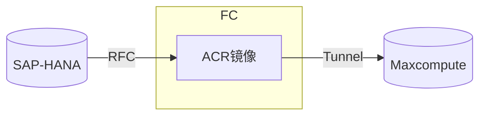
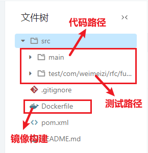

## 项目说明🎈

欢迎加入sap_rfc项目开发，在这里你将快速学会如何调用**RFC函数**以获取SAP的数据。

### 架构

本项目采用**Serveless**架构，通过阿里云的函数计算服务（**FunctionCompute 下称FC**）启动阿里云容器仓库中的**ACR镜像**并执行对应函数，以实现将数据从**RFC**抽取数据至**FC**，并调用**Tunnel组件**的SDK将数据持久化进数仓**STG层**。每个RFC函数都将对应一个阿里云的FC函数，函数间使用的触发器，逻辑，计算资源相互独立。

### 代码目录说明

#### 根目录

- main是存储业务代码的路径

- test是存储测试代码的路径

- Dockerfile会将含jdk1.8和SAP运行时作为基础镜像，并将Maven构建好的jar文件构造新的镜像，存储在阿里云的容器仓库ACR中；

### QuickStart
